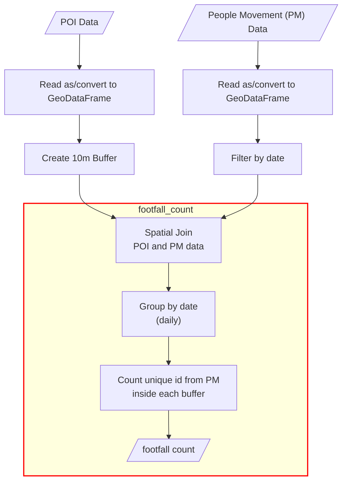
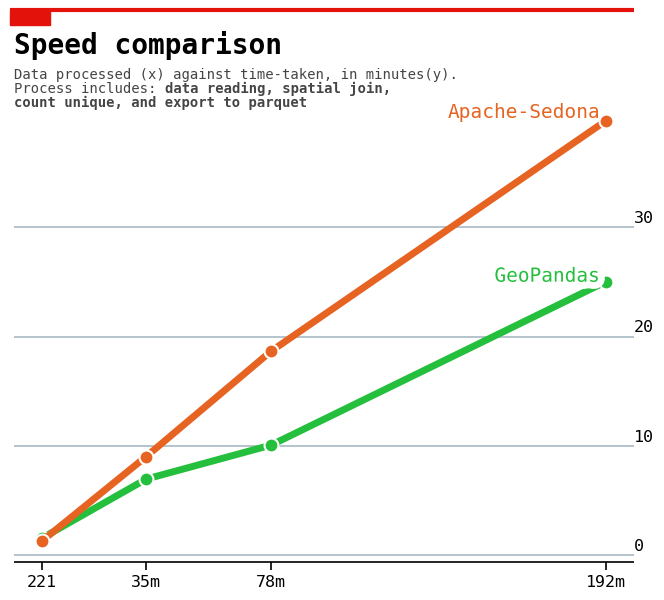

# Spatial database speed comparison

## Workflow

```mermaid
graph TD;
    mpA[/POI Data/] --> mpA1[Read as/convert to GeoDataFrame] --> mpA2[Create 10m Buffer];
    
    mpB[/"People Movement (PM) Data"/] --> mpB1[Read as/convert to GeoDataFrame] --> mpB2[Filter by date];
    
    mpA2 --> mpD[Spatial Join\n POI and PM data];
    mpB2 --> mpD;
    subgraph footfall_count;
        style footfall_count stroke:#F00,stroke-width:2px;
        mpD --> ffA["Group by date \n(daily)"];
        ffA --> ffB[Count unique id from PM\n inside each buffer];
        ffB --> ffC[/footfall count/];
    end
```

## Result

  

